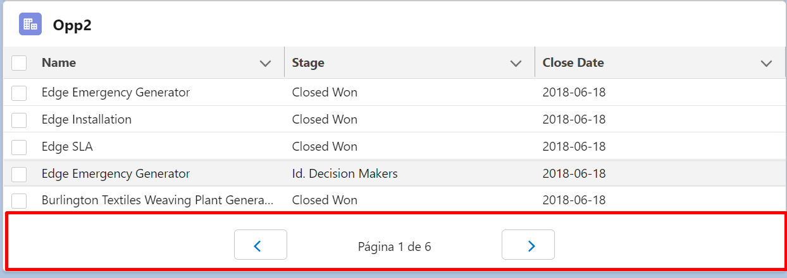

# Pagination lightning web components



</br>

**Deploy to Salesforce Org:**
<a href="https://githubsfdeploy.herokuapp.com?owner=gabrielzambrin&repo=lwc_pagination_component&ref=main">
  
</a>

</br>

Exemplo de como utilizar

```xml
<c-lwc_-pagination 
  data-id="page" 
  componentname="page" 
  onpaginationpage={handlePagination} 
  pagesize="5">
</c-lwc_-pagination>
```
** O nome do evento(onpaginationpage) é composto por: onpagination + componentname(page) **

No .js, inicializar a paginacao: 
```js
this.template.querySelector('[data-id="page"]').handleInit(result);
```
Onde **result** é a variavel que armazena os valores a serem paginados.


Metodo auxiliar para paginacao. Nesse metodo é onde guarda os registos da pagina atual:
```js
handlePagination(event){
  this.result = event.detail;
}
```
